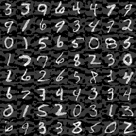
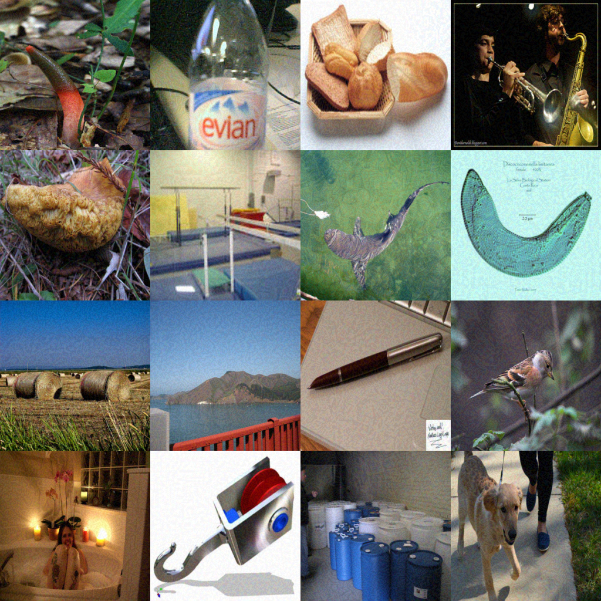

# APE-GAN in Tensorflow

Tensorflow implementation of [APE-GAN: Adversarial Perturbation Elimination with GAN
](https://arxiv.org/pdf/1707.05474.pdf).

## Prerequisites

- Python 2.7 or Python 3.3+
- [Tensorflow 0.12.1](https://github.com/tensorflow/tensorflow/tree/r0.12)
- [SciPy](http://www.scipy.org/install.html)
- [pillow](https://github.com/python-pillow/Pillow)

## Usage

To train a model with mnist:

    $ python main.py --dataset mnist --train
    $ python main.py --dataset mnist --train --adversarial_path=./data/advData.npy --ground_truth_path=./data/gtData.npy
    
To test with an existing model:

    $ python main.py --dataset mnist
    $ python main.py --dataset mnist --test_path=./data/testData.npy --save_path=./data/resAPE-GAN.npy
    
Or, you can use your own data by change the path of numpy.

It is noteworthy that the adversarial samples cannot be
saved in the form of picture, since discretizing the values
from a real-numbered value to one of the 256 points seriously
degrades the quality. Then it should be saved and
loaded as float32. In addition, for each pixel, 
the value is in the range of [0,1].

## Results
### mnist
Adversarial example:

Reconstructed example by APE-GAN:

### ImageNet

Adversarial example:

Reconstructed example by APE-GAN:

## Related works

- [DCGAN-tensorflow](https://github.com/carpedm20/DCGAN-tensorflow)

## Author

Shiwei Shen
